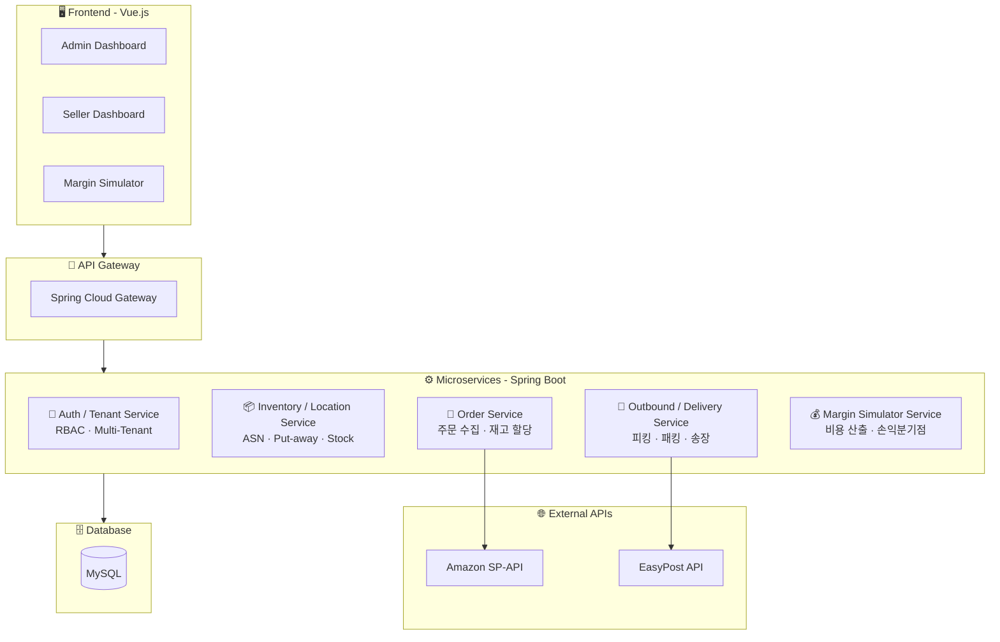

<div align="center">

<!-- Header -->


<br/>

### 🌏 한국 셀러의 글로벌 물류 가시성과 미국 현지 3PL의 운영 효율성을 완벽히 연결하는 B2B SaaS

<br/>

<!-- Badges Row 1 - Status -->


<br/>

<!-- Badges Row 2 - Tech Stack -->


<br/>

<!-- Badges Row 3 - Tools -->


</div>

<br/>

---

## 📌 프로젝트 개요

**CONK**는 수기 작업에 의존하는 미국 내 중소형 3PL 업체의 **WMS(창고관리시스템)** 역량을 강화하고,  
한국 셀러에게 **미국 아마존(FBM) 및 D2C 주문 출고 상태와 예상 마진**을 투명하게 제공하는 **글로벌 풀필먼트 B2B SaaS 플랫폼**입니다.

> 🇰🇷 → 🚢 → 🇺🇸 → 📦 → 🏠  
> 한국에서 출발한 상품이 미국 3PL 창고에 도착해 소비자에게 배송되기까지,  
> **모든 과정을 하나의 플랫폼에서 투명하게 관리합니다.**

<br/>

---

## 💡 핵심 가치 제안

<div align="center">

| | 핵심 가치 | 설명 |
|:---:|:---|:---|
| 🏭 | **3PL 운영 최적화** | 멀티 화주(Multi-Tenant) 구조로 다수 셀러의 재고, 로케이션, 출고를 하나의 대시보드에서 관리 |
| 👁️ | **셀러 가시성 확보** | 재고 위치, 입출고 현황, 주문 상태를 실시간으로 트래킹 |
| 💰 | **수익 예측 (Killer Feature)** | 물류비·관세·수수료를 반영한 **마진 시뮬레이터**로 예상 순이익 즉시 확인 |

</div>

<br/>

---

## 🎯 타겟 고객

```
┌──────────────────────────────────────────────────────────────────┐
│                                                                  │
│   🔧 Admin (3PL 운영사)              👤 User (글로벌 셀러)      │
│   ─────────────────────              ──────────────────────      │
│   미국 거점 중소형 3PL 업체           K-뷰티/K-푸드 브랜드사     │
│   엑셀 → 시스템 전환 니즈             Amazon FBM / Shopify       │
│   다수 한국 셀러 화물 취급             실시간 재고·마진 확인 니즈  │
│                                                                  │
└──────────────────────────────────────────────────────────────────┘
```

<br/>

---

## 🏗️ 시스템 아키텍처 (MSA)



<br/>

---

## ⚡ 핵심 기능

### 📋 WMS (창고 관리 시스템) — Admin

| 기능 | 설명 | MVP |
|:---|:---|:---:|
| ASN 관리 | 셀러 입고 예정 등록 및 검수 | ✅ |
| 하역 & 검수 | 바코드 스캔 기반 실물 검수, 수량 불일치 자동 알림 | ✅ |
| 로케이션 할당 | Zone-Rack-Bin 체계 가상 로케이션 및 재고 위치 등록 | ✅ |
| 피킹 리스트 발행 | 동선 최적화된 화주별/주문별 피킹 리스트 자동 생성 | ✅ |
| 패킹 검수 | 바코드 스캔 → 주문 스펙 대조 → 결품 방지 | ✅ |
| 송장 발부 | EasyPost API 연동 자동 배송 라벨 출력 | ✅ |
| 재고 부족 알림 | Safety Stock 이하 시 셀러 자동 알림 | ✅ |

### 🛒 OMS (주문 관리 시스템) — Seller

| 기능 | 설명 | MVP |
|:---|:---|:---:|
| 주문 수집 | 엑셀 업로드 / 단건 등록 | ✅ |
| Amazon SP-API 연동 | 아마존 주문 자동 수집 | ✅ |
| 가용 재고 할당 | 주문 즉시 → 할당 재고 변경 (과매도 방지) | ✅ |
| 주문 트래킹 | 출고 지시 → Shipped 상태 + 송장번호 실시간 반영 | ✅ |
| 입고 트래킹 | ASN → 하역 → 검수 → 적재 전 과정 가시화 | ✅ |

### 💰 마진 시뮬레이터 — Killer Feature

```
┌─ 셀러 입력 ──────────────────────────────────────────────┐
│  판매가 · 원가 · 무게 · 부피 · 관세 · 운송모드 · 채널   │
└──────────────────────┬───────────────────────────────────┘
                       ▼
┌─ 시스템 자동 계산 ───────────────────────────────────────┐
│  국제운송비 + MPF/HMF + 3PL 보관비 + Pick&Pack          │
│  + 라스트마일 배송비 + 채널 수수료 + 관세               │
└──────────────────────┬───────────────────────────────────┘
                       ▼
┌─ 결과 대시보드 ──────────────────────────────────────────┐
│  📊 비용 구성 파이차트 │ 🔄 해상 vs 항공 비교           │
│  📈 손익분기점 수량     │ ⚠️ 관세 미포함 경고            │
└──────────────────────────────────────────────────────────┘
```

<br/>

---

## 📦 물류 프로세스 플로우

```mermaid
graph LR
    A["🚢 통관 완료<br/>벌크 화물"] --> B["📋 ASN 등록<br/>(셀러)"]
    B --> C["🏭 하역 & 검수<br/>(3PL)"]
    C --> D["📍 Put-away<br/>로케이션 할당"]
    D --> E["📦 재고 활성화<br/>가용 재고 반영"]
    E --> F["🛒 주문 접수<br/>재고 할당"]
    F --> G["📋 피킹 리스트<br/>발행"]
    G --> H["✅ 패킹 검수<br/>바코드 대조"]
    H --> I["🏷️ 송장 출력<br/>EasyPost"]
    I --> J["🚚 출고 확정<br/>재고 차감"]
    J --> K["📊 Shipped<br/>트래킹 반영"]

    style A fill:#0052CC,stroke:#003d99,color:#fff
    style E fill:#00C7B7,stroke:#009688,color:#fff
    style K fill:#6DB33F,stroke:#4a8c29,color:#fff
```



<br/>

---

## 🗓️ 개발 로드맵

<div align="center">

```
  2월              3월                          4월
  ├── W1 ──┼── W2 ──┼── W3 ──┼── W4 ──┼── W5 ──┼── W6 ──┼── W7 ──┼─ W8 ─┤
  │ 📝     │ 📝     │ 📝     │ 🎨     │ ⚙️     │ ⚙️     │ 🔗     │ 🐛   │
  │기획    │기획+FE │기획마감│FE+BE   │  BE    │BE+통합 │통합    │버그  │
  │        │ 시작   │+FE    │ 시작   │       │ 시작   │CI/CD  │수정  │
  │        │        │        │        │        │        │        │      │
  ▓▓▓▓▓▓▓▓▓▓▓▓▓▓▓▓▓▓░░░░░░░░░░░░░░░░░░░░░░░░░░░░░░░░░░░░░░░░░░░░░░░░│
  ████████ 기획 완료 ████████                                    🎯 4/22
```

</div>

| 주차 | 기간 | 단계 | 주요 과업 |
|:---:|:---|:---:|:---|
| **W1** | 02/27 ~ 03/06 | 📝 기획 | 비즈니스 기획서, 요구사항 정의, 아키텍처 초안 |
| **W2** | 03/09 ~ 03/13 | 📝 + 🎨 | WBS, ERD 초안, API 명세, Vue 프로젝트 세팅 |
| **W3** | 03/16 ~ 03/20 | 📝 + 🎨 | ERD 확정, DB 구축, 대시보드 컴포넌트, SP-API 샌드박스 |
| **W4** | 03/23 ~ 03/27 | 🎨 + ⚙️ | 마진 시뮬레이터 UI, Auth/Tenant/RBAC API |
| **W5** | 03/30 ~ 04/03 | ⚙️ | 검수/Put-away API, SP-API 인증, 주문/재고 API |
| **W6** | 04/06 ~ 04/10 | ⚙️ + 🔗 | 피킹/패킹 API, EasyPost 연동, 시뮬레이터 로직 |
| **W7** | 04/13 ~ 04/17 | 🔗 | FE-BE 연동, E2E 테스트, CI/CD 파이프라인 |
| **W8** | 04/20 ~ 04/22 | 🐛 | 버그 수정, 통합 테스트, 최종 마무리 |

<br/>

---

## 🆚 경쟁사 대비 차별점

<div align="center">

| | 범용 WMS 솔루션 | 3PL 자체 구축 | **CONK** ✨ |
|:---|:---:|:---:|:---:|
| **타겟** | 대규모 엔터프라이즈 | 대형 3PL | **K-글로벌 중소 3PL** |
| **도입 비용** | 월 수백~수천 달러 | 수억 원 개발비 | **합리적 구독 SaaS** |
| **마진 시뮬레이터** | ❌ | ❌ | **✅ Killer Feature** |
| **한국어 지원** | ❌ 영문만 | 업체별 상이 | **✅ 한/영 완벽 지원** |
| **온보딩 난이도** | 수주 소요 | 높음 | **핵심 공정 집중, 단순 UI** |

</div>

<br/>

---

## 👥 팀 소개

<!-- 팀원 정보를 채워주세요! -->
<div align="center">

| | 이름 | 역할 | GitHub |
|:---:|:---:|:---:|:---:|
| 🧑‍💻 | OOO | Backend | [@github](https://github.com/) |
| 🧑‍💻 | OOO | Backend | [@github](https://github.com/) |
| 🧑‍🎨 | OOO | Frontend | [@github](https://github.com/) |
| 🧑‍🎨 | OOO | Frontend | [@github](https://github.com/) |

</div>

<br/>

---

## 📚 문서

| 문서 | 링크 |
|:---|:---|
| 📄 서비스 기획서 (비즈니스편) | [바로가기](#) |
| 📐 화면설계서 | [바로가기](#) |
| 🗂️ ERD | [바로가기](#) |
| 📡 API 명세서 | [바로가기](#) |
| 📊 WBS | [바로가기](#) |

<br/>

---

## 📝 데일리 개발 로그

<!-- 매일 저녁 여기에 추가하세요! -->

<details>
<summary><b>📅 2026년 3월</b></summary>

| 날짜 | 작업 내용 | 카테고리 |
|:---:|:---|:---:|
| 03/08 | 프로젝트 README 작성, 레포 초기 세팅 | `docs` |
| 03/09 | WBS 작성, ERD 초안 시작 | `plan` |
| ... | ... | ... |

</details>

<details>
<summary><b>📅 2026년 4월</b></summary>

| 날짜 | 작업 내용 | 카테고리 |
|:---:|:---|:---:|
| ... | ... | ... |

</details>

<br/>

---

<div align="center">


</div>
